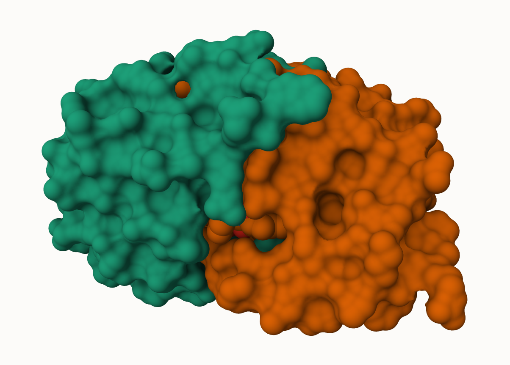
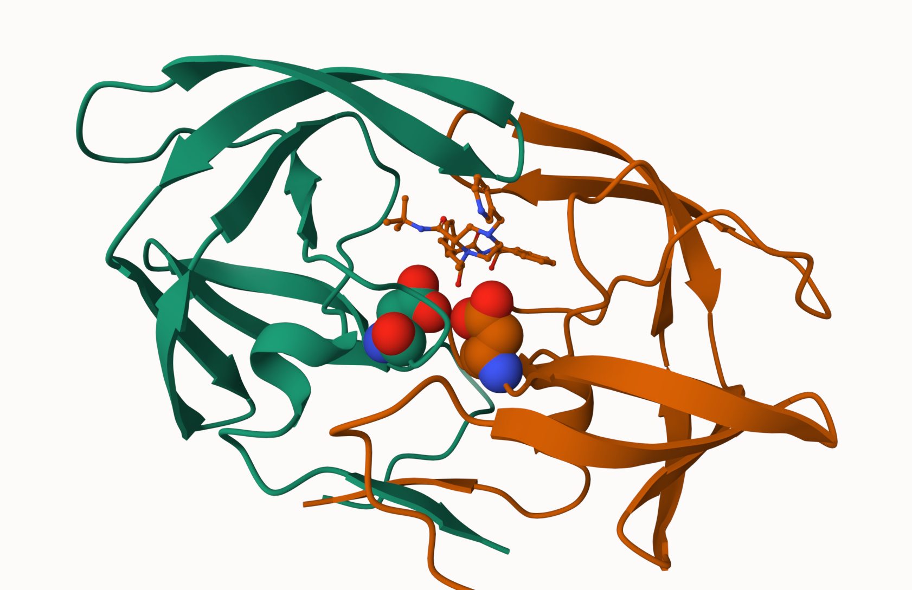

## PDB statistics

The Protein Data Bank (PDB) is the main repository of biomolecular structures. Let's see what it contains:


```{r}
stats <- read.csv("Data Export Summary.csv")
stats
```


```{r}
stats$X.ray
```
```{r}
sum(stats$Neutron)
```

The comma in these numbers leads to the numbers here being read as character.

```{r}
c(100, 10, "barry")
```
```{r}
library(readr)
stats <- read_csv("Data Export Summary.csv")
stats
```


>Q1: What percentage of structures in the PDB are solved by X-Ray and Electron Microscopy.

```{r}
n.xray <- sum(stats$`X-ray`)
#n.em <- 
n.total <- sum(stats$Total)
n.xray/n.total
```


>Q2: What proportion of structures in the PDB are protein?

```{r}
library(dplyr)

stats2 <- stats %>%
  mutate(Total = rowSums(across(where(is.numeric)), na.rm = TRUE))
```

  
```{r}
n.protein_only <- sum(stats2$Total[stats2$`Molecular Type` == "Protein (only)"])
n.total <- sum(stats2$Total)

n.protein_only / n.total
```

>Q3. SKIP..

## Visualizing the HIV-1 protease structure

We can use the Molstar viwerer online:  https://molstar.org/viewer/

>Q4: Water molecules normally have 3 atoms. Why do we see just one atom per water molecule in this structure?

PDB is only representing the Oxygen atoms in the water molecule and not hydrogen. This is a simplified representation.

>Q5: There is a critical “conserved” water molecule in the binding site. Can you identify this water molecule? What residue number does this water molecule have


>Q6: Generate and save a figure clearly showing the two distinct chains of HIV-protease along with the ligand. You might also consider showing the catalytic residues ASP 25 in each chain and the critical water (we recommend “Ball & Stick” for these side-chains). Add this figure to your Quarto document.



A new clean image slowing the catalytic ASP25 amino acids in both chains of the HIV-PR dimer along with the inhibitor and all important active site water.




## Bio3D package for structural bioinformatics

```{r}
library(bio3d)

pdb <- read.pdb("1hsg")
pdb
```
>Q7: How many amino acid residues are there in this pdb object? 

198

>Q8: Name one of the two non-protein residues? 

HOH

>Q9: How many protein chains are in this structure? 

2

```{r}
head(pdb$atom)
```
```{r}
##library(bio3dview)

##view.pdb(pdb)
```

```{r}
# Select the important ASP 25 residue
#sele <- atom.select(pdb, resno=25)

# and highlight them in spacefill representation
#view.pdb(pdb, cols=c("navy","teal"), 
        # highlight = sele,
        # highlight.style = "spacefill")
```


## Predicting functional motions of a single structure

Read an ADK structure from the PDB database:

```{r}
adk <- read.pdb("6s36")
adk
```

```{r}
m <- nma(adk)
plot(m)
```

write out results as a wee trajectory/movie of predicted motions:

```{r}
mktrj(m, file="adk_m7.pdb")
```


